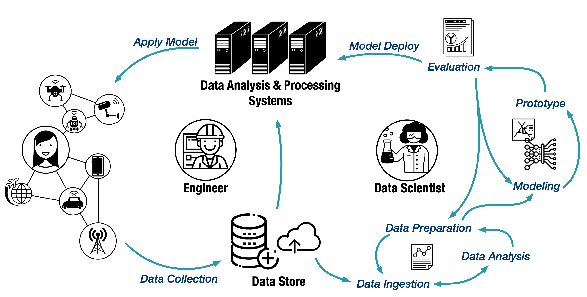
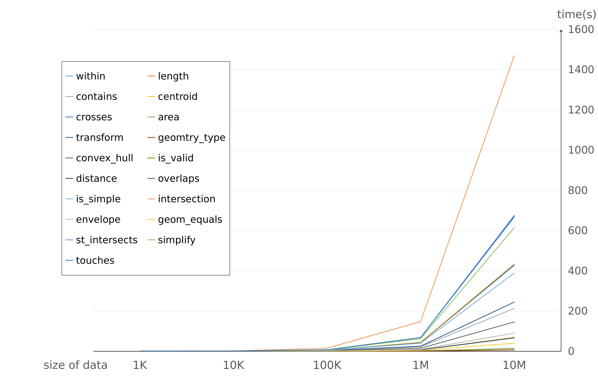

# The missing piece towards 'any scale' spatial-temporal analytics

The Internet of Things (IoT) and 5G technologies will involve an astounding amount of data that record the links between people, device, event, location and time. According to IDC's forcast, there will be 79.4 zettabytes of data generated by 41.6 billion IoT devices in 2025. With the rapid growth of IoT data and IoT applications, there is an ever rising demand for a highly efficent spatial-temperal data science workflow to gain insights from the overwhelming data.

Scalability is the key to build productive data science pipelines. To address the scalability challenge, we launch Arctern, an open source spetaial-temperal analytic framework for boosting end-to-end data science performance. Arctern aims to improve scalability from two aspects: 1. unified data analytic and processing interface accross different platforms, from laptops to clusters and cloud; 2. rich and consistent algorithms and models, including trajectory processing, spatial clustering and regression, etc., accross different data science pipeline stages. 

The rest of this post will investigate current geospatial data science pipelines and review the tools, libraries, and systems used in each stage. Via discussing the existing workflow's drawbacks, we illustrate the importance of scalability. We will show that well scaled interfaces, algorithms, and models form the basis for not only the productivity on solving mathematical and technical problems, but also the efficiency of colaboration and communication between data scientists and engineers. 

### A brief review of spatial-temporal data science workflow

In order to better understand the scalabitly problem existing in the current workflows, we need to take a look at the pipeline of spatial-temporal data science, which is illustrated in the figure above. Raw data are first generated by IoT devices, then collected by data store. The data scientists make exploratory analysis over these data. Basing on technical hypothesis and data features, they select the proper models to develop the prototype to answer business questions. After a few iterations of evaluation and adjustment, the model will be finally deployed on data processing systems, which in turn delivers better services to end users via the IoT devices.

The whole process can be further divided into three stages:

* *Prototype development*. In this stage, data scientists tend to work with small datasets. They seek for fast data exploration,  efficient model selection and iterative prototype polishing. Lightweight tools are more popular in this stage, since they can provide quick insights and support fast iteration. Typical tools are NumPy, GeoPandas, scikit-learn, PySAL, keplergl, etc.
* *Model evaluation*. In order to make the prototype fit better to the production environment, much larger (or even close to production level) datasets are used for model evaluation. As a result, the model evaluation-modification iterations are much less agile than in the prototype stage. More over, the tool chain is much heavier. Most of the commonly used tools are disk-based, or distributed, such as PostGIS, PySpark.
* *Model deployment*. Deployment is the stage in which the model is integrated into the existing production environment to make practicle services. This stage involves large scale systems such as HDFS, Hbase, TSDB for storage, and Spark, Flink, GeoMesa for data processing.

### The scalability problems

At different stages of spatial-temporal data science, the demand for tool chain varies significantly. Although libraries and systems mentioned above can jointly support the overall data science workflow, each individual tool can hardly scale across multiple data science stages or across different analytic platforms (laptop, cluster, cloud). As a result, the tool-box grows too heavy such that the complexity makes it difficult to organize the workflow in an highly efficient manner. Specifically, the challenges are three-fold:

* *The gap between library(system) interfaces*. The libraries or systems used in different stages do not share an unified interface. As a consequence, data scientists may use multiple languages such as Python, R, Scala, SQL and inconsistent function names throughout data analysis, prototype development, model evaluation and model deployment. Such interface inconsistency significantly steepen the learning curve. In addition, it forces data scientists to spend valuable time and brainpower rewriting their codes, rather than focusing on bussiness questions.
* *The gap between algorithm/model libraries*. The libraries used in different stages have different support on algorithms and models. At present, the agreement of standardization is still on the level of primitives, as the ones proposed by the Open Geospatial Consortium (OGC). This raises great problems on productivity. When an advanced algorithm is used as part of the solution during prototype development, but no proper implementation is found for the production environment, great efforts have to be taken to reinvent the wheel.
* *The gap between data scientist and engineer*. Spatial-temporal data science is a complex work in which mathmatical problems, technical problems and bussiness problems need to be properly handled. It calls for seamless collaboration between data scientists and engineers. However, the inconsistency of the tools used throughout the workflow poses a burden during communication. Since different programming languages and algorithm implementations are used in different data science stages, engineers may have no idea on what models the data scientists wrote, while data scientists have no idea on why the engineers can not make the models working.

In the next few sections, we will compare several libraries and systems widely used in spatial-temporal data science, and give more discussions on the missing piece towards 'any scale' spatial-temporal analytics. 

### Popular tools and their limitations

As Python has become the primary solution for geospatial data processing and analysis, data scientists have developed a vocabulary based on a tool set including NumPy, Pandas, Shapely, GeoPandas, PySAL, etc. With these tools, they can fully express their thoughts and follow an idea to its conclusion.

Shapely is a Python package provideing primitives such as geometric data construction, common geometric operations, relationship analysis and coordinate system projection. GeoPandas combines the capabilities of Pandas and Shapely to ease geospatial data processing in python. It organizes geospatial data as GeoSeries or GeoDataFrames and provides operations to construct, analyze and manipulate multiple geometries. 

PySAL is a Python spatial analysis library that provides modules for higher-level analysis on geospatial data. Its functionality includes spatial data exploratory analysis like statistical testing on points, polygonal lattices as well as advanced spatial analysis, such as spatial clustering and spatial regression. 

Despite the popularity, these tools cannot scale to handle big data. They were inherently designed for small datasets that a single machine could handle. Considering hardware capacity of modern laptops and workstations, the size of data that these tools can handle would be up to a couple of GBs. The figure below shows the performance of 19 frequently used primitives in GeoPandas. As we can observe, when data size reaches 10M, most of the primitives in GeoPandas take several minutes to complete. PySAL shares the same problem with GeoPandas when handling large datasets. Compared with the primitives in GeoPandas, the advanced algorithms in PySAL generally have higher computation complexity, thus may cause even severer efficiency problems on data analysis and prototype development. Since data scientists need to iteratively adjust and verify their models until they get satisfying results, these primitives and algorithms are frequently and repeatedly used. The scalability problem would seriously degrade efficiency in spatial data science workflow. 

Due to the scalability problem, the above mentioned tools are generally used in prototype design with small dataset. To work with large production data, data scientists and engineers would eventually need to apply their algorithms in distributed solutions, such as GeoSpark and GeoMesa.

GeoSpark is a cluster computing system that extends Apache Spark and SparkSQL with a set of Spatial Resilient Distributed Datasets and SpatialSQL functions that efficiently load, process, and analyze large-scale spatial data across machines. GeoMesa enables large-scale geospatial querying and analytics on distributed computing systems, including spatio-temporal indexing, stream processing and custom distributed analytics.

| Project | Data Interface | Programming Language |
| --- | --- | --- |
| GeoPandas | GeoDataFrame | python |
| CuSpatial | cuDF | python, C++ |
| PostGIS | Table | PostgreSQL |
| GeoSpark | GeoSpark Spatial RDD | SparkSQL, java, scala |
| GeoMesa Spark | GeoMesa Spatial RDD | SparkSQL, java, scala |

Compared with GeoPandas and PySAL, GeoSpark and GeoMesa adpot very different API abstraction. The Table above presesnts an interface comparison. The data interfaces varias greatly among different tools, with no pair of tools sharing identical data interface. In terms of programming language, there are three major catagories: python, SQL, and Java/Scala. 

| Project | # OGC standard primitives | Advanced models and algorithms |
| --- | --- | --- |
| GeoPandas | 33 | spatial join, etc. |
| PySAL | - | clustering, regression, correlated variance analysis, etc. |
| CuSpatial | - | point-in-polygon, trajectory, etc. |
| PostGIS | 312 | spatial join, etc. |
| GeoSpark | 37 | spatial join, etc. |
| GeoMesa Spark | 75 | spatial join, KNN search,  proximity search, route search, tube selection, etc. |

The table above compares the provided primitives and algorithms among geospatil analysis tools. The number of supported OGC standard primitives shows large difference, ranging from around 30 to three hundreds. The advanced algorithms show great divergence as well. Each of the tools offers a limited set of algorithms that barely overlap.

Due to the significant inconsistency in data interface, programming language, algorithms and models, whenever applying the model prototype to large/production datasets, engineers may have to rewrite the entire data processing logic. For advanced analysis like spatial clustering and regression, data scientists may have to re-implement models and algorithms from scratch.

### Arctern's approach and current progress

To help data scientists and engineers improve productive and creativity, in Arctern, we try to fix the inconsistency problem of spatial data science tools by providing rich primitives, algorithms, and models with consistent interfaces across laptop, cluster and cloud environments. 

Among the tools we studied, we found the interfaces of GeoPandas well fits the usage habits of data scientist in their workflow, meanwhile is easy to use. Therefore, we adopt its idea and plan to build the GeoDataFrame/GeoSeries that scale both up and out. Upon which we will further develop a consistent spatial-temporal algorithm set across execution environments.

At present, we have developed an efficient multi-thread GeoSeries implementation, and the distributed version is in progress. In the latest version 0.2.0, Arctern achieves 24x speed up against GeoPandas. Even under single-thread execution, Arctern outperforms GeoPandas 7x on average. The detailed evaluation results is illustrated in the figure below.

In terms of interaction/exploration on large datasets, Arctern provides rendering methods that can render data (as heatmap, choropleth, etc.) with a volume of 10M in seconds. 

We are also conducting experimental GPU acceleration for spatial-temporal data ananlysis and rendering. By now Arctern provides six GPU-accelerated rendering methods and 8 spatial-relation operations, which outperform their CPU-based counterparts with up to 36x speed up.

In the next few versions, our team will focus on:

* Developing the distributed version of GeoSeries. Our first distirbutied implementation of GeoDataFrame/GeoSeries will be based on Spark. It is developed in sync with Spark 3.0 since its preview release. Spark's supports on GPU scheduling and column-based processing is highly inline with our idea of high-performance spatial-temperal data processing. Besides, the introduced Koalas interface offers a promising option for implementing consistent GeoDataFrame/GeoSeries interfaces.
* Enriching our spatial-temporal algorithm sets. We will concentrate on KNN search and trajectory analysis in the project's early stages. 

### About the Authors

Rentong Guo is a Technical Director at ZILLIZ. He received the Ph.D. degree in Computer Software and Theory from Huazhong University of Science and Technology (HUST), China. He spends his career participating in and leading works focused on database, cache system, distributed system, heterogeneous computing.

Xiaomeng Yi, Seinor reseacher at ZILLIZ. Xiaomeng Yi recieved his Ph.D. degree in Computer Architecture from Huazhong University of Science and Technology. His research focuses on scheduling and resource allocation in the cloud and distributed systems. His works are published in prestigious conferences and journals, such as IEEE Network Magazine, IEEE TON, IEEE ICDCS, and ACM TOMPECS.